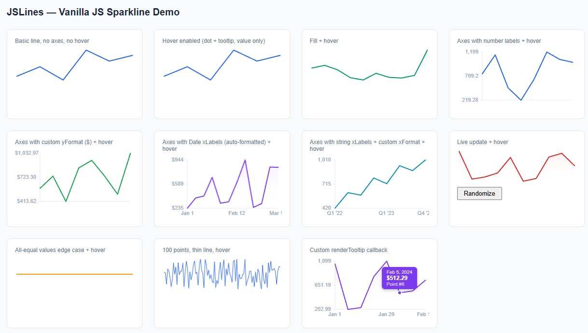

# JSLines

A lightweight, zero-dependency charting library for high-density dashboards. Built on the Canvas API — no SVG, no frameworks, no build step required.



## Why

Most charting libraries are built for one or two charts per page. When you need dozens rendering simultaneously — account balances, trend lines, working paper data — the DOM overhead of SVG-based libraries adds up fast. JSLines uses `<canvas>` directly, keeps allocations out of the render loop, and scales with `ResizeObserver` so layout changes don't trigger unnecessary redraws.

## Installation

No package. Just drop the file in.

```html
<script src="jslines.js"></script>
```

## Basic usage

```js
const chart = new JSLines(document.getElementById('revenue'), {
  data: [1200, 1450, 1100, 1890, 1600, 1750],
});
```

Data can be a flat array of numbers (x inferred as index) or an array of `{ x, y }` objects:

```js
const chart = new JSLines(el, {
  data: [{ x: 1, y: 1200 }, { x: 2, y: 1450 }, { x: 3, y: 1100 }],
});
```

## Options

```js
const chart = new JSLines(el, {
  data: [],             // number[] | { x, y }[]
  type: 'line',         // only 'line' for now
  lineColor: '#2563eb',
  lineWidth: 2,
  fill: false,          // gradient fill below the line
  fillColor: 'rgba(37, 99, 235, 0.1)',
  hover: false,         // enable dot + tooltip on mouseover
  axes: {
    show: false,
    color: '#e5e7eb',
    labelColor: '#94a3b8',
    labelFont: '11px sans-serif',
    xLabels: null,      // string[] | Date[], parallel to data
    yTicks: 3,          // number of Y labels (min, mid, max by default)
    yFormat: null,      // (value: number) => string
    xFormat: null,      // (label: string | Date, index: number) => string
  },
  renderTooltip: null,  // (value, xLabel, index) => HTML string
});
```

## Axes and labels

Turn on axes and pass labels alongside your data. Dates are formatted automatically; pass `xFormat` or `yFormat` to override.

```js
new JSLines(el, {
  data: [420, 610, 780, 940, 880, 1010],
  axes: {
    show: true,
    xLabels: ['Jan', 'Feb', 'Mar', 'Apr', 'May', 'Jun'],
    yFormat: v => '$' + v.toLocaleString(),
  },
});
```

With dates:

```js
new JSLines(el, {
  data: monthlyRevenue,
  axes: {
    show: true,
    xLabels: monthlyRevenue.map((_, i) => new Date(2024, i, 1)),
    yFormat: v => '$' + Math.round(v).toLocaleString(),
  },
});
```

## Hover

Set `hover: true` to get a snapping dot and tooltip out of the box. The tooltip shows the Y value, and the X label if one is available.

```js
new JSLines(el, {
  data: [1200, 1450, 1100, 1890],
  hover: true,
});
```

## Custom tooltip

Pass `renderTooltip` to take full control of the tooltip markup. The tooltip container is unstyled when this option is present, so your HTML is rendered as-is.

```js
new JSLines(el, {
  data: prices,
  hover: true,
  axes: { xLabels: dates },
  renderTooltip: (value, xLabel, index) => `
    <div class="my-tooltip">
      <span class="date">${xLabel.toLocaleDateString()}</span>
      <span class="value">$${value.toFixed(2)}</span>
    </div>
  `,
});
```

`renderTooltip` receives:

| Argument | Type | Description |
|---|---|---|
| `value` | `number` | The Y value at the hovered point |
| `xLabel` | `string \| Date \| null` | The corresponding entry from `axes.xLabels`, or `null` |
| `index` | `number` | The index of the hovered point in the data array |

## Methods

```js
// Replace data without recreating the canvas
chart.update([1300, 1500, 1200, 1950]);

// Clean up — disconnects ResizeObserver and removes DOM nodes
chart.destroy();
```

## Browser support

Anything that supports Canvas 2D, `ResizeObserver`, and ES6 classes. All modern browsers.
